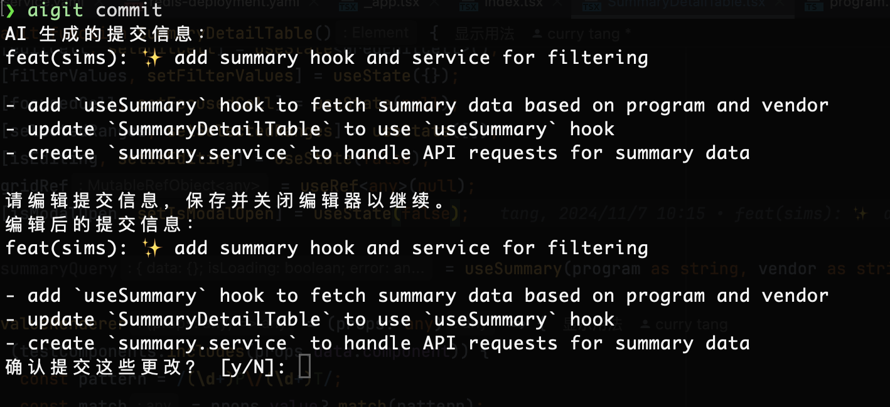

# AI Git Utils

AI git utils is an intelligent Git commit assistant that leverages AI to enhance your Git workflow.
It provides smart commit message generation and emoji selection to make your version control process more efficient and expressive.




## Features

- AI-powered commit message generation
- Interactive emoji selection for commit messages
- Multiple AI model support with easy configuration

## Installation

```bash
pip install ai-git-utils
```

## Usage

Generate AI-assisted commit message

``` 
aigit commit
```

Check the help

``` 
aigit --help
```

