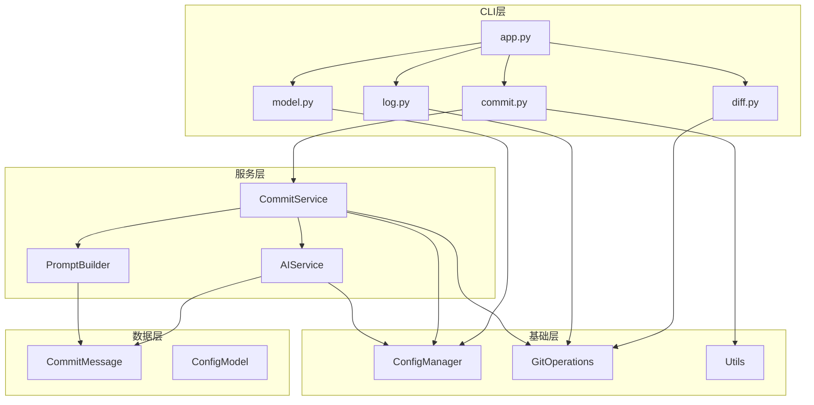

# AI Git Utils 重构计划

## 📊 当前问题分析

### 1. 代码结构问题
- **[`cli.py`](../ai_git_utils/cli.py:1) 文件过大（322行）**：混合了CLI命令、业务逻辑、数据模型定义
- **职责不清晰**：CLI层直接处理AI调用和commit生成
- **[`ai_model.py`](../ai_git_utils/ai_model.py:1) 几乎无用**：只是一个简单的包装函数

### 2. 代码质量问题
- **硬编码内容**：System prompt和emoji列表直接写在CLI命令中
- **缺少数据模型层**：[`CommitMessage`](../ai_git_utils/cli.py:32) dataclass定义在CLI文件中
- **错误处理不够完善**：异常捕获较为简单，缺少统一的错误处理机制
- **缺少类型提示**：部分函数缺少完整的类型注解

## 🎯 重构目标

1. **模块化**：将大文件拆分为多个小文件，每个文件职责单一
2. **分层架构**：CLI层、服务层、数据层清晰分离
3. **可维护性**：提高代码可读性和可维护性
4. **可扩展性**：便于添加新功能和修改现有功能
5. **最佳实践**：遵循Python开发最佳实践

## 📁 新的目录结构

```
ai_git_utils/
├── __init__.py
├── main.py
├── cli/                          # CLI命令层
│   ├── __init__.py
│   ├── app.py                    # 主应用入口
│   ├── commit.py                 # commit命令
│   ├── diff.py                   # diff命令
│   ├── log.py                    # log命令
│   └── model.py                  # model管理命令
├── models/                       # 数据模型层
│   ├── __init__.py
│   ├── commit_message.py         # CommitMessage数据模型
│   └── config.py                 # 配置数据模型
├── services/                     # 业务服务层
│   ├── __init__.py
│   ├── ai_service.py             # AI服务
│   ├── commit_service.py         # Commit服务
│   └── prompt_builder.py         # Prompt构建器
├── config_manager.py             # 配置管理（保持不变）
├── git_operations.py             # Git操作（保持不变）
└── utils.py                      # 工具函数（保持不变）
```

## 🏗️ 架构设计



## 📝 详细实施步骤

### 阶段1：创建目录结构和数据模型

#### 1.1 创建目录结构
- 创建 `cli/` 目录
- 创建 `models/` 目录
- 创建 `services/` 目录
- 创建对应的 `__init__.py` 文件

#### 1.2 创建数据模型

**[`models/commit_message.py`](../ai_git_utils/models/commit_message.py:1)**
```python
"""Commit message data model."""
from dataclasses import dataclass
from typing import List


@dataclass
class CommitMessage:
    """Represents a structured commit message following Conventional Commits."""
    type: str
    scope: str
    emoji: str
    subject: str
    fix_items: List[str]
    
    def to_string(self) -> str:
        """Convert commit message to string format."""
        items = "\n".join(f"- {item}" for item in self.fix_items)
        return f"{self.type}({self.scope}): {self.emoji} {self.subject}\n\n{items}"
```

**[`models/config.py`](../ai_git_utils/models/config.py:1)**
```python
"""Configuration data models."""
from dataclasses import dataclass
from typing import Dict, Any, Optional


@dataclass
class ModelConfig:
    """AI model configuration."""
    model: str
    base_url: str
    temperature: float
    api_key: str
    
    @classmethod
    def from_dict(cls, data: Dict[str, Any]) -> "ModelConfig":
        """Create ModelConfig from dictionary."""
        return cls(**data)
    
    def to_dict(self) -> Dict[str, Any]:
        """Convert ModelConfig to dictionary."""
        return {
            "model": self.model,
            "base_url": self.base_url,
            "temperature": self.temperature,
            "api_key": self.api_key,
        }
```

### 阶段2：创建服务层

#### 2.1 创建 PromptBuilder

**[`services/prompt_builder.py`](../ai_git_utils/services/prompt_builder.py:1)**
```python
"""Prompt building service for AI commit message generation."""
from typing import Dict, Any
from ..models.commit_message import CommitMessage


class PromptBuilder:
    """Builds prompts for AI commit message generation."""
    
    EMOJI_LIST = [
        ("✨", "New feature"),
        ("🐛", "Fix bug"),
        ("📚", "Documentation update"),
        ("🚀", "Deploy stuff"),
        ("💄", "UI/style update"),
        ("🎨", "Improve structure/format of the code"),
        ("🔧", "Configuration modification"),
        ("🔥", "Delete code/file"),
        ("🚑", "Critical fix"),
        ("➕", "Add dependency"),
        ("⚡️", "Performance improvement"),
        ("♻️", "Refactor code"),
        ("👷", "Add or update CI build system"),
    ]
    
    def build_system_prompt(self, language: str = "English") -> str:
        """Build system prompt for AI model."""
        emoji_list = "\n".join(f"- {emoji} {desc}" for emoji, desc in self.EMOJI_LIST)
        
        example = CommitMessage(
            type="fix",
            scope="cli",
            emoji="🐛",
            subject="segmentation fault in inference",
            fix_items=["fix segmentation fault in inference"],
        )
        
        return f'''
Craft clear and concise commit messages following the Conventional Commits standard format for git. 
When presented with a git diff summary, your task is to convert it into a useful commit message and add a brief description of the changes made, ensuring that lines are not longer than 74 characters. 
Your commit message should describe the nature and purpose of the changes in a comprehensive, informative, and concise manner. 
The commit message should return the json object, keep the content concise and to the point.

emoji list:

{emoji_list}

EXAMPLE JSON OUTPUT:
{self._format_example(example)}

output only the json object and answer all my questions in {language}.
'''
    
    def build_user_prompt(self, diff_output: str) -> str:
        """Build user prompt with git diff."""
        return f"git diff summary: \n{diff_output}"
    
    def _format_example(self, example: CommitMessage) -> str:
        """Format example commit message as JSON."""
        from dataclasses import asdict
        import json
        return json.dumps(asdict(example), indent=2, ensure_ascii=False)
```

#### 2.2 创建 AIService

**[`services/ai_service.py`](../ai_git_utils/services/ai_service.py:1)**
```python
"""AI service for generating commit messages."""
from typing import Dict, Any
from openai import OpenAI
from ..models.commit_message import CommitMessage
from ..config_manager import get_active_model
from .prompt_builder import PromptBuilder


class AIService:
    """Service for interacting with AI models."""
    
    def __init__(self):
        """Initialize AI service."""
        self.prompt_builder = PromptBuilder()
    
    def generate_commit_message(
        self,
        diff_output: str,
        language: str = "English"
    ) -> CommitMessage:
        """
        Generate commit message from git diff using AI.
        
        Args:
            diff_output: Git diff output
            language: Output language (English/Chinese)
            
        Returns:
            Generated CommitMessage object
            
        Raises:
            ValueError: If no active model is configured
            RuntimeError: If AI API call fails
        """
        model_config = get_active_model()
        if not model_config:
            raise ValueError("No active model configured")
        
        system_prompt = self.prompt_builder.build_system_prompt(language)
        user_prompt = self.prompt_builder.build_user_prompt(diff_output)
        
        messages = [
            {"role": "system", "content": system_prompt},
            {"role": "user", "content": user_prompt}
        ]
        
        client = OpenAI(
            base_url=model_config.get('base_url'),
            api_key=model_config.get('api_key'),
        )
        
        response = client.chat.completions.create(
            extra_headers={"X-Title": "AIGit"},
            extra_body={},
            model=model_config.get('model'),
            messages=messages,
            temperature=model_config.get('temperature'),
            response_format={'type': 'json_object'}
        )
        
        return self._parse_response(response.choices[0].message.content)
    
    def _parse_response(self, response_text: str) -> CommitMessage:
        """
        Parse AI response into CommitMessage.
        
        Args:
            response_text: JSON response from AI
            
        Returns:
            CommitMessage object
            
        Raises:
            RuntimeError: If response cannot be parsed as JSON
        """
        import json
        try:
            data = json.loads(response_text)
            return CommitMessage(**data)
        except json.JSONDecodeError as e:
            raise RuntimeError(f"Failed to parse AI response: {e}")
```

#### 2.3 创建 CommitService

**[`services/commit_service.py`](../ai_git_utils/services/commit_service.py:1)**
```python
"""Commit service for handling git commit operations."""
from typing import Optional
from git import Repo
from git.exc import InvalidGitRepositoryError, GitCommandError
from ..models.commit_message import CommitMessage
from ..git_operations import get_git_diff, commit_changes
from ..utils import edit_commit_message
from .ai_service import AIService


class CommitService:
    """Service for handling commit operations."""
    
    def __init__(self):
        """Initialize commit service."""
        self.ai_service = AIService()
    
    def create_commit(
        self,
        repo_path: str = ".",
        file_path: Optional[str] = None,
        language: str = "English"
    ) -> bool:
        """
        Create a commit with AI-generated message.
        
        Args:
            repo_path: Path to git repository
            file_path: Optional specific file path
            language: Output language for commit message
            
        Returns:
            True if commit was successful, False otherwise
            
        Raises:
            InvalidGitRepositoryError: If not a valid git repository
            GitCommandError: If git command fails
            RuntimeError: If AI service fails
        """
        repo = Repo(repo_path)
        repo.git.add('.')
        
        diff_output = get_git_diff(repo, True, file_path)
        
        if not diff_output:
            print("No changes detected.")
            return False
        
        # Generate commit message using AI
        commit_message = self.ai_service.generate_commit_message(
            diff_output,
            language
        )
        
        # Format and edit commit message
        initial_message = commit_message.to_string()
        edited_message = edit_commit_message(initial_message)
        
        # Commit changes
        commit_changes(repo, edited_message)
        return True
```

### 阶段3：重构CLI层

#### 3.1 创建 CLI模块

**[`cli/app.py`](../ai_git_utils/cli/app.py:1)**
```python
"""Main CLI application entry point."""
import typer
from .commit import commit
from .diff import diff_app
from .log import log
from .model import model_app
from .version import version

app = typer.Typer()

# Register commands
app.command()(commit)
app.command()(log)
app.command()(version)
app.add_typer(model_app, name="model", help="管理AI模型")
app.add_typer(diff_app, name="diff", help="查看代码更改")
```

**[`cli/commit.py`](../ai_git_utils/cli/commit.py:1)**
```python
"""Commit command implementation."""
import typer
from typing import Optional
from git import Repo
from git.exc import InvalidGitRepositoryError, GitCommandError
from ..services.commit_service import CommitService
from ..config_manager import get_active_model


def commit(
    file_path: Optional[str] = typer.Option(None, "--file", "-f", help="指定文件路径"),
    language: str = typer.Option("English", "--lang", "-l", help="设置语言（English/Chinese）"),
):
    """
    使用 AI 智能生成代码更改信息
    """
    active_config = get_active_model()
    if not active_config:
        typer.echo("错误：未找到激活的模型配置。请先运行 'aigit model add' 或 'aigit model active' 命令。")
        raise typer.Exit(code=1)
    
    try:
        service = CommitService()
        success = service.create_commit(".", file_path, language)
        
        if success:
            typer.echo("更改已成功提交！")
        else:
            typer.echo("没有检测到更改。")
            
    except InvalidGitRepositoryError:
        typer.echo("错误：当前目录不是有效的Git仓库。", err=True)
    except GitCommandError as e:
        typer.echo(f"Git命令执行错误：{str(e)}", err=True)
    except Exception as e:
        typer.echo(f"错误：{str(e)}", err=True)
        raise typer.Exit(code=1)
```

**[`cli/diff.py`](../ai_git_utils/cli/diff.py:1)**
```python
"""Diff command implementation."""
import typer
from typing import Optional
from git import Repo
from git.exc import InvalidGitRepositoryError, GitCommandError
from ..git_operations import get_git_diff, get_commit_diff
from ..utils import beautify_diff

diff_app = typer.Typer()


@diff_app.command("current")
def diff(
    file_path: Optional[str] = typer.Option(None, "--file", "-f", help="指定文件路径"),
):
    """查看代码更改"""
    try:
        repo = Repo(".")
        repo.git.add('.')
        diff_output = get_git_diff(repo, True, file_path)

        if not diff_output:
            typer.echo("没有检测到更改。")
        else:
            beautify_diff(diff_output)

    except InvalidGitRepositoryError:
        typer.echo("错误：当前目录不是有效的Git仓库。", err=True)
    except GitCommandError as e:
        typer.echo(f"Git命令执行错误：{str(e)}", err=True)


@diff_app.command("commit")
def commit_diff(commit_hash: str = typer.Argument(..., help="指定的commit哈希值")):
    """显示指定commit的diff"""
    try:
        repo = Repo(".")
        diff_output = get_commit_diff(repo, commit_hash)
        beautify_diff(diff_output)
    except InvalidGitRepositoryError:
        typer.echo("错误：当前目录不是有效的Git仓库。", err=True)
    except GitCommandError as e:
        typer.echo(f"Git命令执行错误：{str(e)}", err=True)
```

**[`cli/log.py`](../ai_git_utils/cli/log.py:1)**
```python
"""Log command implementation."""
import typer
from datetime import datetime
from git import Repo
from git.exc import InvalidGitRepositoryError, GitCommandError
from rich.console import Console
from rich.table import Table

console = Console()


def log(
    limit: int = typer.Option(10, "--limit", "-n", help="显示的提交数量"),
    since: str = typer.Option(None, "--since", "-s", help="显示指定日期之后的提交，格式：YYYY-MM-DD"),
    until: str = typer.Option(None, "--until", "-u", help="显示指定日期之前的提交，格式：YYYY-MM-DD"),
):
    """美观地显示git log"""
    try:
        repo = Repo(".")
        commits = repo.iter_commits()

        if since:
            since_date = datetime.strptime(since, "%Y-%m-%d")
            commits = filter(lambda c: c.committed_datetime > since_date, commits)

        if until:
            until_date = datetime.strptime(until, "%Y-%m-%d")
            commits = filter(lambda c: c.committed_datetime < until_date, commits)

        table = Table(title="Git Log")
        table.add_column("提交哈希", style="cyan", no_wrap=True)
        table.add_column("作者", style="magenta")
        table.add_column("日期", style="green")
        table.add_column("提交信息", style="yellow")

        for _commit in list(commits)[:limit]:
            table.add_row(
                _commit.hexsha[:7],
                _commit.author.name,
                _commit.committed_datetime.strftime("%Y-%m-%d %H:%M:%S"),
                _commit.message.split("\n")[0],
            )

        console.print(table)

    except InvalidGitRepositoryError:
        typer.echo("错误：当前目录不是有效的Git仓库。", err=True)
    except GitCommandError as e:
        typer.echo(f"Git命令执行错误：{str(e)}", err=True)
```

**[`cli/model.py`](../ai_git_utils/cli/model.py:1)**
```python
"""Model management command implementation."""
import typer
from rich.console import Console
from rich.table import Table
from ..config_manager import (
    add_model_to_config,
    remove_model_from_config,
    set_active_model_in_config,
    load_config,
)

model_app = typer.Typer()
console = Console()


@model_app.command("add")
def add_model(
    name: str = typer.Option(..., prompt=True),
    model: str = typer.Option(..., prompt=True),
    base_url: str = typer.Option(..., prompt=True),
    temperature: float = typer.Option(..., prompt=True),
    api_key: str = typer.Option(..., prompt=True),
):
    """添加新的模型配置"""
    model_config = {
        "model": model,
        "base_url": base_url,
        "temperature": temperature,
        "api_key": api_key,
    }
    add_model_to_config(name, model_config)
    typer.echo(f"模型 '{name}' 已添加并激活。")


@model_app.command("remove")
def remove_model(name: str = typer.Option(..., prompt=True)):
    """删除指定的模型配置"""
    remove_model_from_config(name)
    typer.echo(f"模型 '{name}' 已删除。")


@model_app.command("active")
def activate_model(name: str = typer.Option(..., prompt=True)):
    """激活指定的模型配置"""
    set_active_model_in_config(name)
    typer.echo(f"模型 '{name}' 已激活。")


@model_app.command("list")
def list_models():
    """列出所有可用的模型配置"""
    config = load_config()
    active_model = config["active_model"]

    table = Table(title="可用模型配置")
    table.add_column("模型名称", style="cyan")
    table.add_column("状态", style="magenta")

    for name in config["models"]:
        status = "激活" if name == active_model else ""
        table.add_row(name, status)

    console.print(table)


@model_app.command("show")
def show_config():
    """显示当前的模型配置"""
    config = load_config()
    active_model = config["active_model"]

    if not config["models"]:
        typer.echo("当前没有保存的模型配置。请运行 'aigit model add' 命令添加模型。")
        return

    table = Table(title=f"当前激活的模型配置: {active_model}")
    table.add_column("配置项", style="cyan", no_wrap=True)
    table.add_column("值", style="magenta")

    active_config = config["models"].get(active_model, {})
    for key, value in active_config.items():
        if key == "api_key" and value:
            value = value[:4] + "*" * (len(value) - 4)
        table.add_row(key, str(value))

    console.print(table)
```

**[`cli/version.py`](../ai_git_utils/cli/version.py:1)**
```python
"""Version command implementation."""
import typer
from .. import __version__


def version():
    """显示当前软件版本"""
    typer.echo(f"AI Git Utils V{__version__}")
```

### 阶段4：更新主入口

**[`main.py`](../ai_git_utils/main.py:1)**
```python
from .cli.app import app

if __name__ == "__main__":
    app()
```

### 阶段5：清理和优化

#### 5.1 删除不需要的文件
- 删除 [`ai_model.py`](../ai_git_utils/ai_model.py:1)（功能已集成到AIService）
- 删除旧的 [`cli.py`](../ai_git_utils/cli.py:1)

#### 5.2 更新导入
- 更新所有模块的导入路径
- 确保所有依赖正确

#### 5.3 添加错误处理
- 创建自定义异常类
- 添加统一的错误处理机制

#### 5.4 添加文档字符串
- 为所有类和方法添加完整的文档字符串
- 使用Google或NumPy风格的文档字符串

#### 5.5 添加类型提示
- 确保所有函数都有完整的类型注解
- 使用typing模块的高级特性

## ✅ 验证清单

重构完成后，需要验证以下功能：

- [ ] `aigit commit` 命令正常工作
- [ ] `aigit commit --file` 选项正常工作
- [ ] `aigit commit --lang Chinese` 选项正常工作
- [ ] `aigit diff current` 命令正常工作
- [ ] `aigit diff commit <hash>` 命令正常工作
- [ ] `aigit log` 命令正常工作
- [ ] `aigit log --limit` 选项正常工作
- [ ] `aigit log --since` 和 `--until` 选项正常工作
- [ ] `aigit model add` 命令正常工作
- [ ] `aigit model remove` 命令正常工作
- [ ] `aigit model active` 命令正常工作
- [ ] `aigit model list` 命令正常工作
- [ ] `aigit model show` 命令正常工作
- [ ] `aigit version` 命令正常工作

## 📊 重构收益

1. **代码可读性提升**：每个文件职责单一，易于理解
2. **可维护性提升**：修改某个功能不会影响其他功能
3. **可测试性提升**：服务层可以独立进行单元测试
4. **可扩展性提升**：添加新功能更加容易
5. **符合最佳实践**：遵循Python开发的最佳实践和设计模式

## 🔄 迁移策略

1. **渐进式重构**：先创建新结构，再逐步迁移代码
2. **保持功能不变**：确保重构过程中功能完全一致
3. **充分测试**：每完成一个阶段都要进行测试
4. **文档更新**：及时更新相关文档